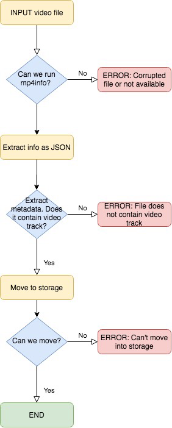
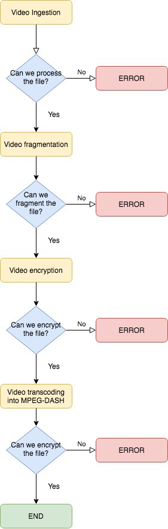
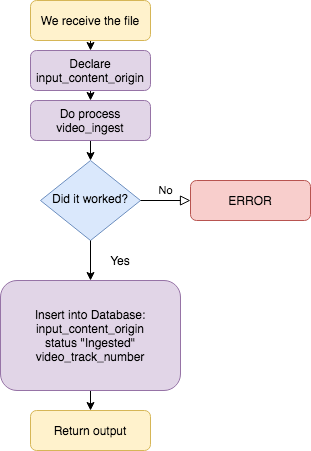

# video_packaging_platform

This is a very basic API with a persistance layer that will process video files as a background task. It will receive them, encrypt them and process them into MPEG-DASH ready to be streamed.

## Getting Started

Obviously, you first need to clone this repo
```
git clone https://github.com/kahache/video_packaging_platform.git
```
And then, you can launch the main App 
```
cd video_packaging_platform
docker build . -t video_packaging_platform --no-cache
docker-compose up
```
It will start running the system on http://0.0.0.0:5000 on your system. 

Once you open that link on your browser, you'll find a small index that will detail you the 4 options you can launch. 

In case you'd like to open locally, please notice you should have the Bento 4 SDK for your current OS and even replace the files at /bin/ and /utils just in case. Once done, just run python3 app/app.py

### Prerequisites

You'll need some software installed in your system:
```
Python 3.6 or higher
MySQL Server
Docker
(in case you run local outside Docker, pip3 install -r app/requirements.txt)
```

### How does it work

This platform opens up a simple web file loader. You can insert files and they will be processed. 
Once you have the files packaged, you can open the files with VLC Media Player or FFPlay. You should be able to hear the audio but you shouldn't be able to see the video.

* The Video logic

For this exercise, first of all we have considerated about the encryption. The point is that the industry recommends to encrypt all the tracks contained in the MP4 file.

However, as in the example given we are only going to have 1 Key and 1 KID, I have decided to encrypt only the video track. Why?

First reason is to be able to track all the video process. When it's success, we can open the file and hear the ideo but receive glitches/bad image as video input. I suspect this is the same way BeIn Sports is encrypted in Spain with Movistar Imagenio: even you know the UDP address and try to record it with FFMpeg (theorically they aren't encrypted), you're able to record a video file with a lot of glitches but with clear sound.

This will also be a way to ensure nobody has done this exercise as this before :-)

So the first point will be to receive a file and determine wether it can be processed or not, and extract metadata from the container like this



As we can see, only files able to be processed will continue the operation.

For the rest of the process, we are going to work in a chain with the required steps to have an MPEG-DASH output.

That means, if one step fails, we can't continue the process. This will be the logic contained inside the main class in video_ops.py



All this is processed in **app/video_ops.py**, which will cal to /bin/ and /utils/ when needed

* The Database

After consider the simplicity of the exercise, I've decided to go only with one table only. This is because the API will only do a few stuff. For further professional environments, we should consider to have several tables and add more data into the tables, such as datetimes (creation, processing, etc), users, etc.

I've considered only 9 rows for this exercise:
```
+----------------------+--------------+------+-----+---------+----------------+
| Field                | Type         | Null | Key | Default | Extra          |
+----------------------+--------------+------+-----+---------+----------------+
| input_content_id     | int(11)      | NO   | PRI | NULL    | auto_increment |
| input_content_origin | varchar(255) | YES  |     | NULL    |                |
| video_track_number   | int(11)      | YES  |     | NULL    |                |
| status               | varchar(255) | YES  |     | NULL    |                |
| output_file_path     | varchar(255) | YES  |     | NULL    |                |
| video_key            | varchar(255) | YES  |     | NULL    |                |
| kid                  | varchar(255) | YES  |     | NULL    |                |
| packaged_content_id  | int(11)      | YES  | UNI | NULL    |                |
| url                  | varchar(255) | YES  |     | NULL    |                |
+----------------------+--------------+------+-----+---------+----------------+
9 rows in set (0,00 sec)
```
**_input_content_id:_** : the ID generated for each file that is ingested in the platform.  

**_input_content_origin_** : The path of the original file. This will be used to check if we have already uploaded a file with that name or not. 

**_video_track_number_** : Video track number ID from metadata extracted with Bento4 utils, notice for other softwares as FFMpeg should be different wether they count zero as first or not.

**_status_** : This is very important. This will be a text cell that will explain the last operation done with that video file.
    It can be:
    
    "Ingested" - file moved to storage and video track number saved
    "Fragmented" - file has been fragmentated
    "Encrypted" - file's video track has been encrypted with the KEY and KID values given in the JSON
    "Ready" - file has been converted into MPEG-DASH and has a URL output

**_output_file_path_** : This will be the path of the last processed file. For each video process, we generate a new file. For this exercise we aren't deleting the non-usable files, so we can track the results. Notice that for further production environments, this should be erased with some cronjob 

**_video_key_** : video KEY for AES CBCS encryption given by user

**_kid_** : video KID for AES CBCS encryption given by user 

**_packaged_content_id_** : ID for a file that is in the process of being packaged. This is a random number generated by our main App.

**_url_** : Last cell, only filled if a video has been packaged and contains its output link. For this exercise it will be inside the filepath inside the server.       

For the docker, the database is declared in **/db/db.init.sql** 

* The operations logic, mixing Video and Database 

This is quite simple. The first endpoint is what happens when we click on "upload" and we sent the file into the system:



The second endpoint is called with a JSON, for example:
```
POST​ /packaged_content {
“input_content_id”: 1,
“key”: “hyN9IKGfWKdAwFaE5pm0qg”,
“kid”: “oW5AK5BW43HzbTSKpiu3SQ” }
```
So everything starts to run in the background with this logic:


Quite simple.

The third endpoint doesn't need explanation, it will just do a Database query and return the output as a JSON.

For example, we call it like:
```
GET​ /packaged_content/55
```

And will receive an output like:
```
{
"packaged_content_id": 73
"url": http://localhost:8080/5F8LNI/dash/stream.mpd

}
```

* The Flask API

This simply redirects the endpoints of the API with the templates and the operations. It's the main file, which gets executed automatically and starts the service at http://0.0.0.0:5000

IMPORTANT: For this exercise, we aren't erasing the files in the process. This means we can track and check the video outputs before it's full done in the output/ folder. This also means that one video can have 'several' content_package_id. I mean, it's not checking wether the file has been already packaged or not. This has been done like this in order to do several testings with only 1 uploaded file. If we want to avoid this, the code should be changed.
## Guide to validate playback correctness of the content packaged. 

When we have the output, I've added an extra endpoint to start a file browser service with different port (this should be user access, not API access).
```
GET http://0.0.0.0:5000 
```
So we can call the last method of the API to run this service. Once ran, we should be able to browse the file from the browser opening http://0.0.0.0:8080/videos (as we see, now the output is 8080 instead of the original 5000, be careful so you don't confuse!)

Once it's open, we can open the video directly with [VLC Media Player](https://www.videolan.org/vlc/index.es.html) or with [FFPlay](https://ffmpeg.org/ffplay.html).

If we open the video, we shouldn't be able to see the video track as it's encrypted. This has been tested with both softwares.

To check the decrypted video, you should have Google Chrome installed with a higher version than 69.

First you should edit the file 
```
/tests/test_player/myapp.js
```
Here you need to replace the output URL you should have from the packaged content, e.g. for http://localhost:8080/NZ7KLC/dash/stream.mpd
```
const manifestUri =
    'http://localhost:8080/NZ7KLC/dash/stream.mpd';
```

Then in the same file, you should convert your KEY and KID into hexadecimal and put it inside. For example, let's assume we have the values:
```
"key":"hyN9IKGfWKdAwFaE5pm0qg","kid":"oW5AK5BW43HzbTSKpiu3SQ"
```
If we go to this [Base64 converter website](https://cryptii.com/pipes/binary-to-base64) or any other website, we can convert the previous values into hexadecimal:
```
"key":"87237d20a19f58a740c05684e699b4aa","kid":"a16e402b9056e371f36d348aa62bb749"
```
Now that you have the values in hexadecimal, you should put them inside the code of myapp.js. You'll find just a few lines down. Keep in mind the KID goes before KEY!:
```
  // IMPORTANT!
  // Here we add the concrete KID and KEY we need to decrypt the video.
  player.configure({
  drm: {
    clearKeys: {
      // 'key-id-in-hex': 'key-in-hex',
      'a16e402b9056e371f36d348aa62bb749': '87237d20a19f58a740c05684e699b4aa'
      }
    }
  });
```

And save the file, obviously :-)

Second we need to open the Chrome browser without [cors](https://en.wikipedia.org/wiki/Cross-origin_resource_sharing), you can follow [this very simple guide and open from terminal](https://alfilatov.com/posts/run-chrome-without-cors/).
Then open this path as the URL:
```
YOUR/PATH/TO/REPO/video_packaging_platform/tests/test_player/player.html
```

And enjoy the video!

In order to do further testing, we should consider using another specialized players and test with different browsers, such us:
·Test Player from [DASH IF](https://github.com/Dash-Industry-Forum/dash.js/blob/development/samples/drm/clearkey.html)
·Test Player from private Video services such as 
[Bitmovin](https://bitmovin.com/demos/drm), info [here](https://bitmovin.com/docs/player/tutorials/how-to-play-mpeg-cenc-clearkey-content)
[Wowza](https://www.wowza.com/testplayers)
And so on. You can check almost any company you'll find in Pavilion number 14 @ IBC each year. Or for example it seems there are some players online:
[JW Player](https://www.jwplayer.com/developers/stream-tester/)

IMPORTANT: Please notice none of this players have been tested.

# How would I modify/extend the service so we achieve multi bitrate resolution? 

There are some solutions. 

The first one is to process the video with [FFMpeg](https://ffmpeg.org), the infamous video tool that lets you do (almost) everything. One option can be to transcode the video file and use a multibitrate output. However, FFMpeg doesn't allow us to encrypt the video with ClearKey. This has been tested and I've already did in the past video with different bitrates. So if we avoid the encryption process, this can be a real solution.

The second one, (this hasn't been tested) and seems to be the real how-to, is to work with [MP4Box](https://gpac.wp.imt.fr). It seems this software allows us to combine with FFMpeg and it lets us to encrypt the files.
More info about this method on these 2 links from the guys from Streamroot, first [here](https://blog.streamroot.io/encode-multi-bitrate-videos-mpeg-dash-mse-based-media-players/) and [here](https://blog.streamroot.io/encode-multi-bitrate-videos-mpeg-dash-mse-based-media-players-22/)

Another important point is this API hasn't been intended to be multithread as it wasn't required. So it would be really interesting in order to extend the service, to work with task queue and be able to manage all the processes.
## Running the tests

To run the tests, get with Linux/UNIX terminal into the /tests/ forlder and run:
```
bash run_tests.sh
```
There you'll find a dialog box where you can choose the different tests to run. It's highly recommended to first download the test videos otherwise it can give errors. Feel free to check out the code and change variables or situations you'd like to test.

Also, please notice this aren't the typical unit tests. They can run background operations too. This has been intended to be able to test MP4 corrupted video files, in order to check wether they can be processed or not.

## Files included in this package

```
.
└── video_packaging_platform
    ├── Dockerfile
    ├── README.md
    ├── app
    │   ├── app.py
    │   ├── database.py
    │   ├── main_ops.py
    │   ├── models.py
    │   ├── requirements.txt
    │   ├── templates
    │   │   ├── file_upload_form.html
    │   │   ├── success.html
    │   │   └── success_packaged.html
    │   └── video_ops.py
    ├── bin
    │   ├── mp4-dash.py
    │   ├── mp4dash
    │   ├── mp4decrypt
    │   ├── mp4dump
    │   ├── mp4encrypt
    │   ├── mp4fragment
    │   ├── mp4info
    │   └── mp4split
    ├── db
    │   └── init.sql
    ├── docker-compose.yml
    ├── images
    │   ├── Video\ Operations\ logic.jpg
    │   ├── VideoOperationsLogic.png
    │   ├── video_ops_ingest.jpg
    │   └── video_ops_ingest.png
    ├── tests
    │   ├── TEST_VIDEOS
    │   │   ├── download_videos.sh
    │   │   └── public_test_video_list.txt
    │   ├── __init__.py
    │   ├── run_tests.sh
    │   ├── test_app.py
    │   ├── test_database.py
    │   ├── test_models.py
    │   └── test_video_ops.py
    └── utils
        ├── aes.py
        ├── check-indexes.py
        ├── mp4-dash-clone.py
        ├── mp4-dash-encode.py
        ├── mp4-dash.py
        ├── mp4-hls.py
        ├── mp4utils.py
        ├── pr-derive-key.py
        ├── skm.py
        ├── subtitles.py
        └── wv-request.py
```

## Built With

* [Python](https://www.python.org/downloads/release/python-360/) - Most programming language used
* [Flask](https://flask.palletsprojects.com/en/1.1.x/) - Framework used to generate the API
* [Flask-SQLAlchemy](https://flask-sqlalchemy.palletsprojects.com/en/2.x/) - Library used as ORM
* [MySQL](https://www.mysql.com) - Relational database system used
* [Bento4](https://www.bento4.com) - MP4 & Dash library
* [Docker](https://www.docker.com) - PaaS that uses OS-level virtualization to deliver software in packages called containers

## Authors

* **Javier Brines Garcia** - *Initial work* - [LinkedIn](https://www.linkedin.com/in/javi-brines-cto)

## License

This project is licensed under the MIT License - see the [LICENSE.md](LICENSE.md) file for details

## Acknowledgments

* Guillem C. & David V.
* Roc a.k.a. Roc Rocks, for the Docker comments
* Ben M., for the tips with the player
